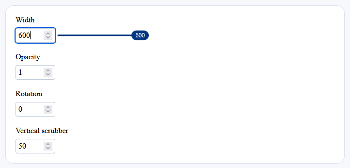

# Simple Scrubber JS

 

A small JavaScript library for adding visual scrubbers to regular HTML number inputs.

Try the demo on GitHub pages: [https://donitzo.github.io/simple-scrubber-js](https://donitzo.github.io/simple-scrubber-js)

## Usage

Include the script on your page:

```html
<script src="./simplescrubber.js"></script>
```

Add the attribute `data-scrubber-pixels-per-step` to any number input, with the value indicating the number of pixels the mouse must travel per step. Add `data-scrubber-vertical` for a vertical scrubber.

```html
<input
    type="number"
    value="100"
    min="0"
    max="500"
    step="10"
    data-scrubber-pixels-per-step="8"
>
```

If you add number inputs to the page after the initial load, call:

```js
window.createNumberScrubbers();
```

Edit the constants in `simplescrubber.js` to change the scrubber style.
